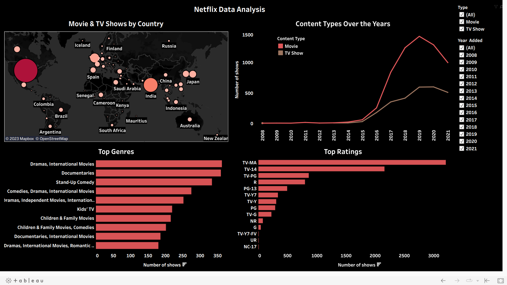
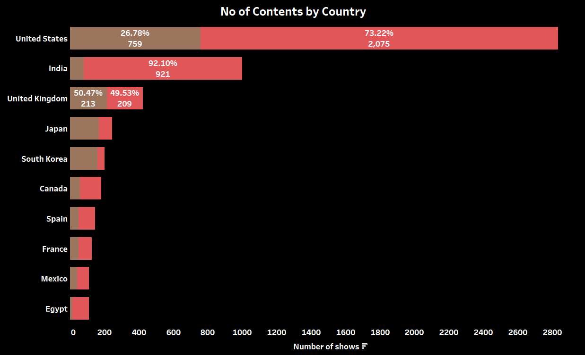

<!-- PROJECT LOGO -->
 

  

  <h1 align="center"> Netflix Data Analysis </h1>

   

# About this project
## Project Overview & Scope

Check out the dashboard published [here](https://public.tableau.com/views/CustomerChurnAnalysis_16874898423310/ChurnAnalysis?:language=en-US&:display_count=n&:origin=viz_share_link).

Netflix is a popular streaming service that offers a vast catalog of movies, TV shows, and original contents. The data consist of contents added to Netflix from 2008 to 2021. The oldest content is as old as 1925 and the newest as 2021. In this project, I have cleaned the dataset using Python and then visualized with Tableau. **The purpose of this project is to figure out possible ways for cleaning text data and dealing with timeseries values in Python, along with visualization of cleaned data using Tableau for spotting any trends or pattern in the data.**

## Data Cleaning:

The raw dataset can be found [here](https://www.kaggle.com/datasets/shivamb/netflix-shows). This tabular dataset consists of listings of all the movies and tv shows available on Netflix, along with details such as - cast, directors, ratings, release year, duration, etc.

I have cleaned this dataset using Python, and the code can be found [here](https://github.com/himalayasharma/netflix-data-analysis/blob/master/Data_Wrangling_Script.ipynb). The final cleaned dataset used for visualization can be found [here](https://github.com/himalayasharma/netflix-data-analysis/tree/master/data).

## Insights from Tableau

I have attached a [link]() to my Tableau Dashboard Used in this analysis.

* As can be seen, the majority of the content on Netflix are Movies which take 69.69% of the total content.
* There are more details in the tooltip which shows the exact count of Movie and Tv show.

* **United States of America has the largest proportion of content on Netflix, followed by India and the United Kingdom.** The size of the circle is proportional to the percentage of content belonging to a particular country. Please see the tooltip for more details.

The following visual gives more detail into the data presented in previous viz.

**It also shows that top 2 countries for Netflix are United States and India and in both the majority content type is movies.**

The following time series chart shows the total number of contents added to Netflix all through the given years (2008 - 2021). **It shows that most movies and tv shows on Netflix were added in 2019.**

**After that it registered a decline in the number of shows, possibly due to the onset of COVID-19.**

The following chart shows the top 10 directors with most contents on Netflix. It also shows the count of Movie and Tv shows in their catalogue.

* Most of these directors’ contents are movies.
* The duo of Raul Campos and Jan Suter are fond of working together and have directed 18 movies on Netflix.

The following viz shows the genres with the highest numbers on Netflix (Top 10).

**Drama & International movies followed by Documentary have the highest number of contents on Netflix within the given period.**

Rating is a system to rate motion picture's suitability for certain audiences based on its content. The following visual shows the top ratings on Netflix.

**Most contents on Netflix are rated TV-MA or TV-14. TV-MA in the United States by the TV Parental Guidelines signifies content for mature audiences and TV-14 signifies content with parents strongly cautioned.** So it gives an appropriate picture of audience who shall be allowed to view content on Netflix or for whom Netflix hosts content.

The following line chart compares the Movie and Tv shows contents added to Netflix all through the years.

* One can see that more movies have always been added.
* In 2013, the number of contents added to Netflix for both were almost the same with Movies having 6 contents that year and Tv shows having 5.
* It shows that in the first 5 years, only movies were added to Netflix.

## Conclusion:

4 mains visuals from the analysis have been put together in a dashboard as hosted above. I have presented only a handful of insights in this project. There is always more one can find, as it has been rightly said **"Torture the data enough, and it will confess to anything".**

I would like to take a moment to thank anyone who has seen my project. I have tried to keep the Python source file as descriptive as possible. If there is any suggestion for improvement or any query regarding my logic, please feel free to contact me and I would be more than happy to have a casual discussion about my projects and yours as well.

Thanks a lot again for being a patient audience!